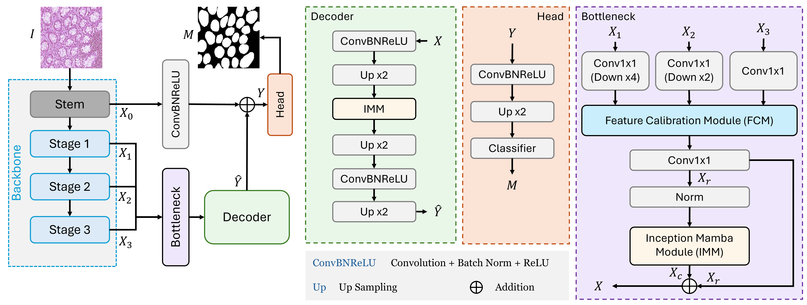
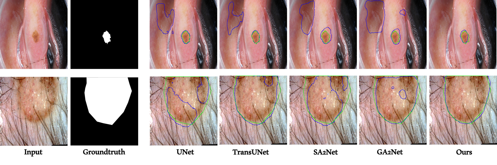

# InceptionMamba

[](https://arxiv.org/abs/2506.12208)

Official repository for **InceptionMamba: Efficient Multi-Stage Feature Enhancement with Selective State Space Model for 2D Medical Image Segmentation**

> Daniya Najiha Abdul Kareem¹, Abdul Hannan², Mubashir Noman¹, Jean Lahoud¹, Mustansar Fiaz¹, Hisham Cholakkal¹  
> ¹Mohamed bin Zayed University of AI, UAE  
> ²University of Trento, Italy  
> Under Review

---


## 🔥 Highlights

- **State-of-the-Art Performance**: Achieves SOTA results on 4 medical image segmentation benchmarks
- **Computational Efficiency**: 5× fewer GFLOPs compared to previous best method (GA2-Net) in SegPC2021 dataset 
- **Novel Architecture**: Introduces Inception Mamba Module (IMM) combining depth-wise convolutions with Mamba blocks
- **Robust Design**: Simple decoder without dense skip connections for better efficiency
- **Comprehensive Evaluation**: Extensive experiments on 2D medical segmentation datasets


---

## Architecture
<div align="center">
  
</div>


## 🏗️ The Structure of Codes

```
.
├── README.md
├── images/
│   └── *.png
├── configs/
│   ├── isic/
│   │   └── isic2018_inceptionmamba.yaml
│   ├── segpc/
│   │   └── segpc2021_inceptionmamba.yaml
│   └── glas/
│       └── glas_inceptionmamba.yaml
├── datasets/
│   ├── isic.py
│   ├── isic2017_a.py
│   ├── segpc.py
│   ├── prepare_isic.py
│   ├── prepare_segpc.py
│   └── README.md
├── models/
│   ├── inception_mamba.py
│   └── README.md
├── train_and_test/
│   ├── isic/
│   │   ├── train_inceptionmamba_isic2018.py
│   │   ├── test_inceptionmamba_isic2018.py
│   │   └── inceptionmamba-isic2018.ipynb
│   ├── segpc/
│   │   ├── train_inceptionmamba_segpc.py
│   │   ├── test_inceptionmamba_segpc.py
│   │   └── inceptionmamba-segpc.ipynb
│   └── glas/
│       ├── train_inceptionmamba_glas.py
│       ├── test_inceptionmamba_glas.py
│       └── inceptionmamba-glas.ipynb
├── losses.py
├── utils.py
├── requirements.txt
└── INSTALL.md
```

---

## 📊 Results

### Quantitative Comparison

**SegPC21 Dataset** (Plasma Cell Segmentation)

| Method | Params (M) | GFLOPs | Dice (%) | IoU (%) |
|--------|------------|---------|----------|---------|
| U-Net | 14.8 | 50.3 | 88.08 | 88.20 |
| UNet++ | 74.5 | 94.6 | 91.02 | 90.92 |
| nnUNetV2 | 22.4 | 64.9 | 91.44 | 90.93 |
| AttUNet | 34.9 | 101.9 | 91.58 | 91.44 |
| TransUNet | 105.0 | 56.7 | 82.33 | 83.38 |
| UCTransNet | 65.6 | 63.2 | 91.74 | 91.59 |
| U-Mamba | 12.36 | 51.5 | 91.79 | 91.83 |
| LKMUNet | 123.8 | 251.5 | 92.20 | 92.02 |
| GA2-Net | 17.36 | 32.61 | 92.49 | 92.32 |
| **InceptionMamba (ResNet50)** | 11.92 | 6.72 | **92.56** | **92.37** |
| **InceptionMamba (PVT-V2-B2)** | 27.27 | **4.86** | **92.84** | **92.63** |

**GlaS Dataset** (Gland Segmentation) - Using 3×5-fold cross-validation

| Method | Dice (%) | IoU (%) |
|--------|----------|---------|
| U-Net | 85.45 ± 1.3 | 74.78 ± 1.7 |
| UNet++ | 87.56 ± 1.2 | 79.13 ± 1.7 |
| nnUNetV2 | 89.71 ± 0.9 | 84.52 ± 0.5 |
| TransUNet | 88.40 ± 0.7 | 80.40 ± 1.0 |
| UCTransNet | 90.18 ± 0.7 | 82.96 ± 1.1 |
| SA2-Net | 91.38 ± 0.4 | 84.90 ± 0.6 |
| UDTransNet | 91.03 ± 0.6 | 83.70 ± 0.5 |
| **InceptionMamba** | **91.88 ± 0.3** | **85.65 ± 0.4** |

**ISIC2018 & ISIC2017** (Skin Lesion Segmentation)

| Method | ISIC2018 Dice (%) | ISIC2018 IoU (%) | ISIC2017 Dice (%) | ISIC2017 IoU (%) |
|--------|-------------------|-------------------|-------------------|-------------------|
| U-Net | 86.71 | 84.91 | 81.59 | 79.32 |
| UNet++ | 88.22 | 86.51 | 82.32 | 80.13 |
| nnUNetV2 | 88.63 | 86.91 | 87.91 | 86.31 |
| UCTransNet | 88.98 | 87.29 | 88.81 | 87.22 |
| U-Mamba | 89.37 | 88.12 | 89.60 | 88.45 |
| LKMUNet | 89.33 | 87.60 | 90.25 | 88.89 |
| GA2-Net | 89.29 | 87.69 | 89.99 | 88.58 |
| **InceptionMamba** | **90.56** | **88.98** | **91.16** | **89.82** |

### Visualization

**ISIC 2018 Results**

<div align="center">
  
</div>

Visual comparisons on ISIC 2018 skin lesion segmentation. Ground truth boundaries are shown in **green**, predicted boundaries in **blue**.

**SegPC 2021 Results**

<div align="center">
  
</div>

Visual comparisons on SegPC 2021 plasma cell segmentation. **Blue** region indicates nucleus, **red** indicates cytoplasm.

---

## 🚀 Getting Started

### Installation

Please see [INSTALL.md](INSTALL.md) for detailed installation instructions.

**Quick Start:**

```bash
# Clone repository
git clone https://github.com/YOUR_USERNAME/InceptionMamba.git
cd InceptionMamba

# Create conda environment
conda create -n inceptionmamba python=3.10
conda activate inceptionmamba

# Install PyTorch
conda install pytorch==2.1.1 torchvision==0.16.1 pytorch-cuda=11.8 -c pytorch -c nvidia

# Install dependencies
pip install -r requirements.txt
```

### Dataset Preparation

Please see [datasets/README.md](datasets/README.md) for detailed dataset preparation instructions.

**Quick Links:**
- **SegPC21**: [IEEE Dataport](https://ieee-dataport.org/competitions/segmentation-multiple-myeloma-plasma-cells-microscopic-images)
- **GlaS**: [Warwick Dataset](https://warwick.ac.uk/fac/cross_fac/tia/data/glascontest/)
- **ISIC2017**: [ISIC Challenge 2017](https://challenge.isic-archive.com/data/#2017)
- **ISIC2018**: [ISIC Challenge 2018](https://challenge.isic-archive.com/data/#2018)

After downloading, prepare datasets:

```bash
# SegPC21
python datasets/prepare_segpc.py --data_path /path/to/segpc21 --output_path ./data/segpc21

# ISIC2018
python datasets/prepare_isic.py --data_path /path/to/isic2018 --output_path ./data/isic2018 --year 2018
```

---

## 🎯 Training and Testing

### Training

**SegPC21:**
```bash
python train_and_test/segpc/train_inceptionmamba_segpc.py
```

**ISIC2018:**
```bash
python train_and_test/isic/train_inceptionmamba_isic2018.py
```

**GlaS (with 3×5-fold cross-validation):**
```bash
python train_and_test/glas/train_inceptionmamba_glas.py
```

### Testing

**SegPC21:**
```bash
python train_and_test/segpc/test_inceptionmamba_segpc.py
```

**ISIC2018:**
```bash
python train_and_test/isic/test_inceptionmamba_isic2018.py
```


## 📦 Pretrained Model Weights

Download pre-trained weights for InceptionMamba:

| Dataset | Backbone | Dice (%) | IoU (%) | Download Link |
|---------|----------|----------|---------|---------------|
| SegPC21 | ResNet50 | 92.56 | 92.37 | [Download](https://mbzuaiac-my.sharepoint.com/:u:/g/personal/mustansar_fiaz_mbzuai_ac_ae/EUlZi2Kbbf5DoEtnbX9lFtEBlvS9eSddVbI_VgQxAD257w) |
| SegPC21 | PVT-V2-B2 | 92.84 | 92.63 | [Download](https://mbzuaiac-my.sharepoint.com/:u:/g/personal/mustansar_fiaz_mbzuai_ac_ae/EUlZi2Kbbf5DoEtnbX9lFtEBlvS9eSddVbI_VgQxAD257w) |
| GlaS | ResNet50 | 91.88 | 85.65 | [Download](https://mbzuaiac-my.sharepoint.com/:u:/g/personal/mustansar_fiaz_mbzuai_ac_ae/EUlZi2Kbbf5DoEtnbX9lFtEBlvS9eSddVbI_VgQxAD257w) |
| ISIC2018 | ResNet50 | 90.56 | 88.98 | [Download](https://mbzuaiac-my.sharepoint.com/:u:/g/personal/mustansar_fiaz_mbzuai_ac_ae/EUlZi2Kbbf5DoEtnbX9lFtEBlvS9eSddVbI_VgQxAD257w) |
| ISIC2017 | ResNet50 | 91.16 | 89.82 | [Download](https://mbzuaiac-my.sharepoint.com/:u:/g/personal/mustansar_fiaz_mbzuai_ac_ae/EUlZi2Kbbf5DoEtnbX9lFtEBlvS9eSddVbI_VgQxAD257w) |

---

## 📝 Citation

If you find InceptionMamba useful in your research, please consider citing:

```bibtex

@misc{kareem2025inceptionmambaefficientmultistagefeature,
      title={InceptionMamba: Efficient Multi-Stage Feature Enhancement with Selective State Space Model for Microscopic Medical Image Segmentation}, 
      author={Daniya Najiha Abdul Kareem and Abdul Hannan and Mubashir Noman and Jean Lahoud and Mustansar Fiaz and Hisham Cholakkal},
      year={2025},
      eprint={2506.12208},
      archivePrefix={arXiv},
      primaryClass={cs.CV},
      url={https://arxiv.org/abs/2506.12208}, 
}
```

---

## 🙏 Acknowledgements

This work builds upon several excellent projects:

- [U-Net](https://github.com/milesial/Pytorch-UNet) - Original U-Net implementation
- [Mamba](https://github.com/state-spaces/mamba) - State Space Models
- [U-Mamba](https://github.com/bowang-lab/U-Mamba) - Mamba for medical image segmentation
- [SA2-Net](https://github.com/mustansarfiaz/SA2-Net) - Scale-aware attention
- [Awesome-U-Net](https://github.com/NITR098/Awesome-U-Net) - Comprehensive U-Net review
- [timm](https://github.com/huggingface/pytorch-image-models) - PyTorch Image Models

---

## 📧 Contact

For questions, collaborations, or issues, please contact:

- **Daniya Najiha Abdul Kareem**: daniya.kareem@mbzuai.ac.ae

Or open an issue on [GitHub Issues](https://github.com/YOUR_USERNAME/InceptionMamba/issues)

---


</div>
